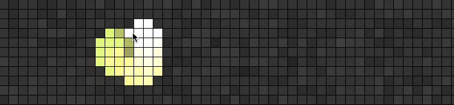

# pixel-grid

[](https://npmjs.org/package/pixel-grid)
[](https://travis-ci.org/freeman-lab/pixel-grid) 

> render a grid of little squares

Small module for rendering a grid of squares. Handles a wide variety of inputs, and supports custom sizing and spacing. Use it for data visualization, for art, or just for fun! Built with webgl and [`regl`](https://github.com/mikolalysenko/regl) so it's pretty fast.

[](http://pixel-grid.surge.sh/)

## install

Add to your project with

```
npm install pixel-grid
```

## example

Run this

```js
var grid = require('pixel-grid')

var data = [
  [0, 1, 1, 0], 
  [1, 0, 0, 1], 
  [0, 1, 0, 0]
]

var pixels = grid(data, {
  root: document.body,
  size: 25
})
```

To see


## usage

#### `var pixels = require('pixel-grid')(data, opts)`

The `data` are the values to render in each square, and can be passed in two ways

- flat array `[a, b, c, d]`
- nested array `[[a, b], [c, d]]`

Each value `a, b, ...` can be specified in several ways

- an rgb color `[0, 1, 1]`
- a single number `0.5` which will be interpreted as `[0.5, 0.5, 0.5]`
- a color string like `rgb(0, 255, 255)` or `#ffa500`

All the options in `opts` are optional, and include

- `rows` `columns` number of rows and columns in the grid
- `root` a root element to which to append the created canvas
- `size` size of each square in pixels, default `10`
- `padding` space between each square in pixels, default `2`
- `background` color of the background as rgb or string, default `[0.25, 0.25, 0.25]`
- `formatted` set to true if data is already in canonical form (flat array of rgb colors)

Grid dimensions are determined as follows

- If a nested array is passed, its shape is used to get the number of rows and columns
- If a flat array is passed, its shape is based on `opts.rows` and `opts.columns`
- If those are unspecified, we use the largest square grid that contains all values

## properties

#### `pixels.canvas`

The created canvas element for appending to the DOM yourself as in

```js
var grid = require('pixel-grid')
var pixels = grid([[0, 1], [1, 0]])
document.body.appendChild(pixels.canvas)
```

## methods

#### `pixels.update(data)`

Update the pixel grid with new data

```js
var grid = require('pixel-grid')
var pixels = grid([[0, 1], [1, 0]], {root: document.body})
pixels.update([[1, 0], [0, 1]])
```

#### `pixels.frame(cb)`

Provide a callback for each frame refresh (via raf). Allows you to sync updates with monitor refreshes

```js
var grid = require('pixel-grid')
var pixels = grid([[0, 1], [1, 0]], {root: document.body})
pixels.frame(function () {
  pixels.update([[Math.random(), Math.random()], [Math.random(), Math.random()]])
})
